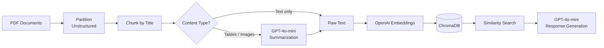

# RAG Pipeline — Multimodal Document Q&A

A **Retrieval-Augmented Generation** pipeline that ingests PDF documents containing text, tables, and images, and enables natural language question answering over their content using OpenAI LLMs.

## Features

- **Multimodal ingestion** — processes text, HTML tables, and images from PDFs
- **Intelligent chunking** — splits documents by semantic sections (titles/headings)
- **LLM-powered summarization** — generates searchable descriptions for rich content (tables, images) using GPT-4o-mini
- **Vector search** — stores embeddings in ChromaDB for fast cosine similarity retrieval
- **Grounded answers** — generates responses strictly based on retrieved documents

## Architecture



## Tech Stack

| Component | Technology |
|---|---|
| PDF Parsing | [Unstructured](https://docs.unstructured.io/) (`hi_res` strategy) |
| Framework | [LangChain](https://python.langchain.com/) |
| Vector DB | [ChromaDB](https://www.trychroma.com/) |
| Embeddings | OpenAI `text-embedding-3-small` |
| LLM | OpenAI `gpt-4o-mini` |

## Project Structure

```
Rag_project/
├── src/
│   ├── utils.py          # Core pipeline functions
│   ├── ingestion.py      # Document ingestion script
│   └── retrieve.py       # Query & response script
├── docs/                 # PDF documents to ingest
├── db/                   # ChromaDB persistent storage
├── .env                  # API keys (not tracked)
├── requirements.txt
└── README.md
```

## Getting Started

### Prerequisites

- Python 3.10+
- An [OpenAI API key](https://platform.openai.com/api-keys)

### Installation

```bash
# Clone the repository
git clone https://github.com/nicolalunardi/RAG.git
cd RAG

# Create and activate a virtual environment
python -m venv venv
source venv/bin/activate  # macOS/Linux

# Install dependencies
pip install -r requirements.txt
```

### Configuration

Create a `.env` file in the project root:

```env
OPENAI_API_KEY=your-api-key-here
```

### Usage

**1. Ingest documents** — place your PDFs in the `docs/` folder, then run:

```bash
python src/ingestion.py
```

This will partition, chunk, summarize, embed, and store all documents in ChromaDB.

**2. Query your documents:**

```bash
python src/retrieve.py
```

You'll be prompted to enter a question. The system retrieves the top-5 most relevant chunks and generates a grounded answer.

### Example

```
$ python src/retrieve.py
Enter your query: What are the conditions for legitimate interest under GDPR?

Top 5 documents retrieved:

  [1] in order to sue that person for damages, protecting the property,
      health and life of the co-owners of a building, product improvement...
  [2] "Legitimate" nature of the interest pursued by the controller or
      by a third party. The concept of "interest" is closely related to...
  [3] For example, the CJEU found that the following interest of a third
      party is, in principle, likely to constitute a legitimate interest...
  [4] A newspaper envisages to create a database consisting of former
      subscribers who have not renewed their subscription...
  [5] General public interest or third party's interest. Interests of
      third parties, as mentioned in Article 6(1)(f) GDPR...

Answer:
The conditions for legitimate interest under GDPR, specifically Article
6(1)(f), are as follows:

1. Lawfulness: The interest must be lawful, meaning it should not be
   contrary to EU or Member State law.
2. Clear Articulation: The interest must be clearly and precisely
   articulated to ensure it can be balanced against the interests or
   fundamental rights and freedoms of the data subject.
3. Real and Present: The interest must be real and present, not
   speculative. It must be effective at the time of data processing
   and not hypothetical.

These criteria must be cumulatively met for an interest to be considered
legitimate under GDPR.
```

## Possible Improvements

- [ ] Add evaluation metrics (e.g. faithfulness, relevance) with [RAGAS](https://docs.ragas.io/)
- [ ] Support additional file formats (DOCX, HTML, Markdown)
- [ ] Add a conversational interface with chat history and context memory