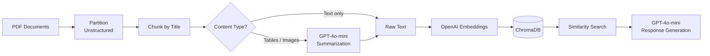

# 📄 RAG Pipeline — Multimodal Document Q&A

A **Retrieval-Augmented Generation** pipeline that ingests PDF documents containing text, tables, and images, and enables natural language question answering over their content using OpenAI LLMs.

## ✨ Features

- **Multimodal ingestion** — processes text, HTML tables, and images from PDFs
- **Intelligent chunking** — splits documents by semantic sections (titles/headings)
- **LLM-powered summarization** — generates searchable descriptions for rich content (tables, images) using GPT-4o-mini
- **Vector search** — stores embeddings in ChromaDB for fast cosine similarity retrieval
- **Grounded answers** — generates responses strictly based on retrieved documents

## 🏗️ Architecture



## 🛠️ Tech Stack

| Component | Technology |
|---|---|
| PDF Parsing | [Unstructured](https://docs.unstructured.io/) (`hi_res` strategy) |
| Framework | [LangChain](https://python.langchain.com/) |
| Vector DB | [ChromaDB](https://www.trychroma.com/) |
| Embeddings | OpenAI `text-embedding-3-small` |
| LLM | OpenAI `gpt-4o-mini` |

## 📁 Project Structure

```
Rag_project/
├── src/
│   ├── utils.py          # Core pipeline functions
│   ├── ingestion.py      # Document ingestion script
│   └── retrieve.py       # Query & response script
├── docs/                 # PDF documents to ingest
├── db/                   # ChromaDB persistent storage
├── .env                  # API keys (not tracked)
├── requirements.txt
└── README.md
```

## 🚀 Getting Started

### Prerequisites

- Python 3.10+
- An [OpenAI API key](https://platform.openai.com/api-keys)

### Installation

```bash
# Clone the repository
git clone https://github.com/nicolalunardi/RAG.git
cd RAG

# Create and activate a virtual environment
python -m venv venv
source venv/bin/activate  # macOS/Linux

# Install dependencies
pip install -r requirements.txt
```

### Configuration

Create a `.env` file in the project root:

```env
OPENAI_API_KEY=your-api-key-here
```

### Usage

**1. Ingest documents** — place your PDFs in the `docs/` folder, then run:

```bash
python src/ingestion.py
```

This will partition, chunk, summarize, embed, and store all documents in ChromaDB.

**2. Query your documents:**

```bash
python src/retrieve.py
```

You'll be prompted to enter a question. The system retrieves the top-5 most relevant chunks and generates a grounded answer.

### Example

```
$ python src/retrieve.py
Enter your query: What are the conditions for legitimate interest under GDPR?

Top 5 documents retrieved:

  [1] The controller must carry out a balancing test to ensure...
  [2] Legitimate interest requires three cumulative conditions...
  ...

Answer:
According to the retrieved documents, legitimate interest under the GDPR
requires three cumulative conditions: (1) the pursuit of a legitimate interest
by the controller or a third party, (2) the necessity of processing for that
purpose, and (3) that the interests or rights of the data subject do not
override the legitimate interest pursued.
```

## 📌 Possible Improvements

- [ ] Add evaluation metrics (e.g. faithfulness, relevance) with [RAGAS](https://docs.ragas.io/)
- [ ] Support additional file formats (DOCX, HTML, Markdown)
- [ ] Add a conversational interface with chat history and context memory